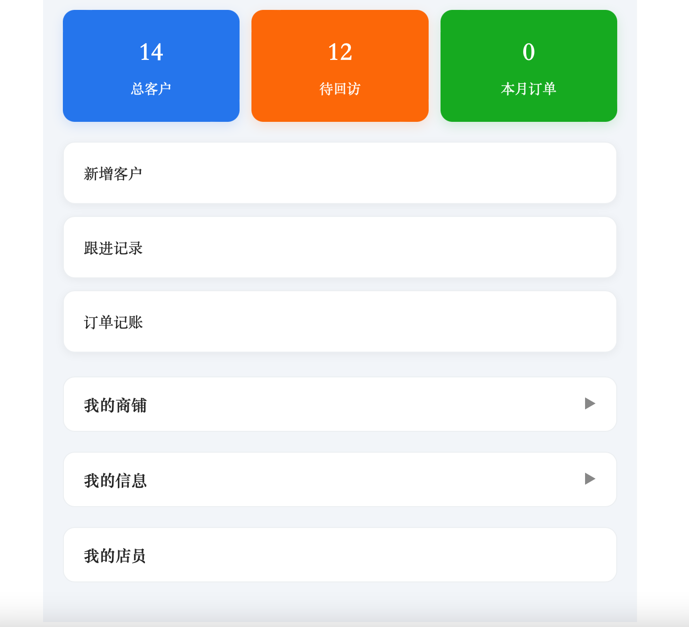

# Simple CRM 简易客户管理系统
> 个人练习Demo，用于演示后端基础业务开发，非商用项目

## 项目介绍
基于SpringBoot开发的简易CRM系统。
实现客户信息管理、跟进记录维护、客户标签管理，支持基础的列表查询、新增、编辑、删除功能。
适合小微企业客户线索登记，简化销售客户台账管理。

## 技术栈
- 后端：SpringBoot 2.7 + MyBatis-Plus
- 数据库：MySQL 8.0
- 接口文档：Swagger
- 工具：Maven、Git

## 主要功能
✅ 客户档案：新增/编辑/删除客户信息
✅ 跟进记录：添加客户拜访、沟通记录
✅ 客户标签：对客户打标签，便于分类筛选
✅ 条件查询：按客户名称、时间、标签检索客户

## 项目运行
1. 创建MySQL数据库，执行sql目录下初始化脚本
2. 修改application.yml数据库连接配置
3. Maven打包，启动SpringBoot主类
4. 访问Swagger接口文档：http://localhost:8080/swagger-ui.html

## 说明
本项目为个人Demo，仅用于技术展示，可用于学习、二次开发参考。
不包含复杂权限、高并发等生产级特性，请勿直接上线商用。

## 可提供服务
本人可承接Java后端bug修复、SQL优化、接口开发、简单管理系统改造。
如有需求，可联系。
